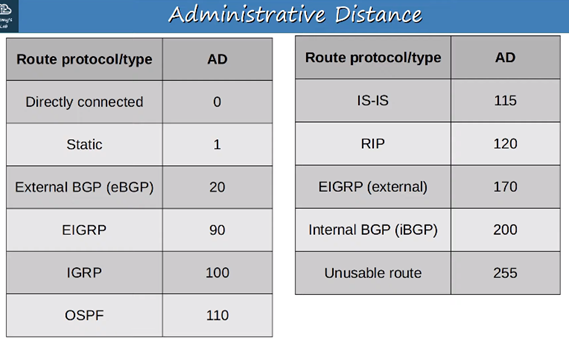
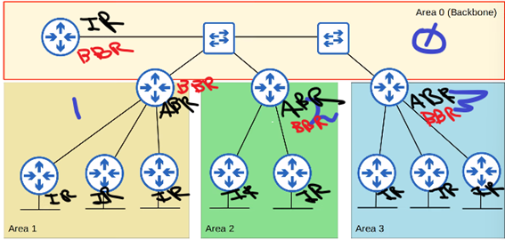

##### <mark>***samuca***</mark>
<!-- omit in toc -->
# ***Resumen Parcial 3 Redes***
<!-- omit in toc -->
## Índice

- [Aspectos Generales L3](#aspectos-generales-l3)
  - [Modelos de servicios de red](#modelos-de-servicios-de-red)
    - [CONS: Connection Oriented Network Service | Modelo direccionamiento de Circuito Virtual](#cons-connection-oriented-network-service--modelo-direccionamiento-de-circuito-virtual)
    - [CLNS: ConnectionLess Network Service | Modelo de direccionamiento de datagramas](#clns-connectionless-network-service--modelo-de-direccionamiento-de-datagramas)
  - [CLNS Forouzan](#clns-forouzan)
    - [Internet como una red de datagramas](#internet-como-una-red-de-datagramas)
    - [Internet como una red no orientada a conexión](#internet-como-una-red-no-orientada-a-conexión)
  - [Funciones del nivel de Red](#funciones-del-nivel-de-red)
- [Tiempos de servicio](#tiempos-de-servicio)
  - [Propiedades del tiempo de servicio](#propiedades-del-tiempo-de-servicio)
  - [Diseño de capacidad de una red](#diseño-de-capacidad-de-una-red)
- [Protocolos dinámicos de enrutamiento](#protocolos-dinámicos-de-enrutamiento)
  - [IGP: Distance Vector](#igp-distance-vector)
    - [Funcionamiento del algoritmo:](#funcionamiento-del-algoritmo)
    - [Características diferenciales del algoritmo:](#características-diferenciales-del-algoritmo)
    - [Timers:](#timers)
    - [Problemas comunes](#problemas-comunes)
  - [IGP: Link State](#igp-link-state)
    - [Características diferenciales del algoritmo:](#características-diferenciales-del-algoritmo-1)
    - [Algoritmo aplicado por cada router a su LSDB](#algoritmo-aplicado-por-cada-router-a-su-lsdb)
  - [Routers con múltiples protocolos de enrutamiento dinámico](#routers-con-múltiples-protocolos-de-enrutamiento-dinámico)
- [Routing Information Protocol](#routing-information-protocol)
  - [Características diferenciales del protocolo](#características-diferenciales-del-protocolo)
  - [Autenticación:](#autenticación)
  - [RIP Timers](#rip-timers)
- [Enhanced Interior Gateway Protocol](#enhanced-interior-gateway-protocol)
  - [Características diferenciales del protocolo](#características-diferenciales-del-protocolo-1)
  - [Métrica:](#métrica)
  - [EIGRP Timers](#eigrp-timers)
  - [Load Balancing](#load-balancing)
- [Open Shortest Path First](#open-shortest-path-first)
  - [Características diferenciales del protocolo](#características-diferenciales-del-protocolo-2)
  - [Áreas en OSPF](#áreas-en-ospf)
  - [OSPF vs EIGRP:](#ospf-vs-eigrp)
- [Protocolo de Internet](#protocolo-de-internet)
  - [Interconexión entre redes](#interconexión-entre-redes)
    - [Necesidad del nivel de red](#necesidad-del-nivel-de-red)
  - [IPv4](#ipv4)
    - [Datagrama](#datagrama)
      - [Fragmentación](#fragmentación)
        - [Unidad de transferencia máxima (MTU)](#unidad-de-transferencia-máxima-mtu)
        - [Campos relacionados con la fragmentación](#campos-relacionados-con-la-fragmentación)
      - [Opciones](#opciones)

# Aspectos Generales L3

- La capa de red es la capa que se encarga del direccionamiento de los paquetes a través de los diferentes caminos que forman la Internet.
- Su función principal es el direccionamiento.
- Se constituye con enlaces que interconectan dos tipos de nodos:
  - Hosts
  - Routers
- Los routers tienen varias interfaces y los hosts (generalmente) una.
- Cuando se comunican dos hosts en una misma LAN, la capa 3 es casi inexistente.
- De esto se encargan los conmutadores de capa 2, puentes o L2 switches.
- Cuando un hosts quiere comunicarse con otro, en el transcurso del paquete por la red la cabecera de capa 2 cambiará cada vez que llegue a un nodo (exceptuando los conmutadores, que solo revisan la cabecera de capa 2 y en base a esto toman la decisión de reenvío de la trama), ahora, en capa 3, cada que el paquete pase por un Router, el mismo revisará la cabecera de capa 3 y en base a la información contenida en la misma decidirá que hacer con el paquete, si descartarlo o redireccionarlo hacia alguna de sus interfaces basado en la información almacenada en su tabla de enrutamiento. Esto es, la dirección IP origen y destino de un paquete NO cambia en el transcurso del paquete desde su origen hacia su destino.
- ARP es un protocolo de capa 3.
- IP es un protocolo enrutado (routed) de capa 3.
- RIP, EIGRP, IGRP, OSPF, IS-IS, BGP son protocolos (dinámicos) de enrutamiento (routing protocols) de capa 3.
- IP es un protocolo enrutado de capa 3 NO ORIENTADO A CONEXIÓN.
- Los protocolos no orientados a conexión funcionan con datagramas, se toman decisiones de direccionamiento cada vez que un paquete llega a un Router.
- Los protocolos orientados a conexión establecen una conexión cada vez que se va a iniciar una transmisión, toman las decisiones de direccionamiento una sola vez y una vez establecida la conexión no se vuelven a tomar decisiones de direccionamiento, funcionan con PVC’s, o permanente virtual circuits, circuitos virtuales.
- El funcionamiento de los protocolos de capa 3 enrutados orientados a conexión es casi igual que el de los protocolos orientados a conexión de capa 2 como Frame relay o ATM.
- Actualmente se utiliza (casi) siempre protocolos de capa 3 no orientados a conexión, y el predominante es el protocolo de Internet, (IP; Internet Protocol)
- El hecho de que IP sea no orientado a conexión significa que tienen una máxima del mayor esfuerzo, los paqutes pueden llegar desordenados o perderse en el camino y quien se encargará de controlar esto es la capa superior (si es que se utiliza un protocolo de capa 4 orientado a conexión como lo es TCP)
- Los servicios de transmisión son 3:
  - Prioridad; ej.: mensajes de control
  - QoS (Calidad de servicio); umbral de retardo máximo o umbral de requerimiento mínimo
  - Seguridad; restricción de accesos
- El protocolo IP busca no agregar demasiada información redundante a los paquetes, reduce el overhead.

## Modelos de servicios de red

Un modelo de servicio de red define las características del transporte terminal a terminal. Esto es, si la entrega es garantizada o no, si se garantiza el retardo mínimo o no, si los paquetes se entregan en orden, cual es el ancho de banda mínimo garantizado y cuales son los servicios de seguridad que ofrece.

En la realidad, en el Internet se utiliza el protocolo IP que hace uso del servicio del mejor esfuerzo.

### CONS: Connection Oriented Network Service | Modelo direccionamiento de Circuito Virtual

Se establece una conexión antes de iniciar la transmisión. Ej.: modelo de direccionamiento de circuito virtual.

En este modelo cada VC consta de una ruta, números de vc y entradas en las tablas de reenvío de los routers.

En la conexión, la capa de red define la ruta entre el emisor y el receptor, el número de VC para cada ruta del enlace, añade una entrada a la tabla de reenvío de los routers y puede reservar recursos.

Ejemplo:

Cabe destacar que esto no es lo mismo que una red de circuitos, sigue siendo una red conmutada pero con circuitos virtuales, la diferencia con una red conmutada es que no existe reserva de recursos, el circuito es virtual, esto es, en torno a la toma de decisiones de direccionamiento y no de reserva de un canal físico.

### CLNS: ConnectionLess Network Service | Modelo de direccionamiento de datagramas

Este es el modelo utilizado en la realidad, no garantiza la entrega de los paquetes en orden, ni la entrega en sí misma, el mejor esfuerzo hace referencia a que se intenta hacer lo mejor posible por llevar el paquete desde el origen hasta el destino pero no se asegura nada, esta responsabilidad se delega sobre las capas superiores (generalmente la capa de transporte cuando se utiliza el protocolo de capa 4 TCP que es orientado a conexión y es quien se encargará de establecer la conexión lógica en una comunicación entre dos estaciones.

Un servicio CLNS es recomendable cuando la red es poco fiable, por el hecho de que si falla un Router en el camino de un paquete hacia su destino, el mismo podrá tomar otra dirección.

Por el contrario si se utiliza un servicio CONS y falla un Router el paquete no podrá llegar a su destino, por lo que son utilizados cuando la red es muy fiable, como pasa en las redes de telefonía, donde por el contrario, en la capa superior se utiliza un protocolo no orientado a conexión como lo es el UDP.

Algunas de las diferencias de el modelo de direccionamiento de datagramas con respecto al modelo de direccionamiento por circuitos virtuales son las siguientes:

- Cuando una estación quiere enviar un paquete le agrega dirección de origen y destino (dirección IP)
- No se realiza configuración de circuito virtual previa.
- Los routers no mantienen información de estado.
- Cada Router tiene una tabla de reenvío donde asigna direcciones de destino a interfaces de enlace para saber sobre que interfaz debe redireccionar un paquete que se destina a una red determinada.
- Se utiliza un prefijo de red que es la parte de la dirección IP que determina la dirección de red.

## CLNS Forouzan

### Internet como una red de datagramas

En Internet, el nivel de enlace de red es una red de conmutación de paquetes. En general, la conmutación se puede dividir en tres amplias categorías: conmutación de circuitos, conmutación de paquetes y conmutación de mensajes. La conmutación de paquetes utiliza circuitos virtuales o datagramas.

En internet se ha elegido el enfoque basado en datagramas para la conmutación en el nivel de red. Utiliza una dirección universal definida en el nivel de red para encaminar paquetes del origen al destino.

### Internet como una red no orientada a conexión

La entrega de un paquete se puede realizar utilizando un servicio de red orientado a conexión o uno no orientado a conexión. En un servicio orientado a conexión, el origen establece en primer lugar una conexión con el destino antes de enviar el paquete. Cuando la conexión se establece, se puede enviar una secuencia de paquete s del mismo origen al mismo destino. En este caso, hay una relación entre los paquetes. Se envían por el mismo camino en orden secuencial. Un paquete se encuentra conectado lógicamente con el paquete que viaja delante de él y con el que viaja detrás de el. Cuando se han entregado todos los paquetes de un mensaje, se finaliza la conexión.

En un protocolo orientado a conexión, la decisión sobre el camino de una secuencia de paquetes con la misma dirección origen y destino se puede hacer una sola vez, cuando se establece la conexión. Los conmutadores no recalculan el camino para cada paquete individual. Este tipo de servicio utiliza el enfoque de circuitos virtuales para la conmutación de paquetes, como Frame Relay y ATM.

En un servicio no orientado a conexión, el protocolo de nivel de red trata cada paquete de forma independiente y los paquetes no tienen relación entre ellos. Los paquetes de un mensaje pueden viajar o no por el mismo camino hasta el destino. Este tipo de servicio utiliza el enfoque basado en datagramas para la conmutación de paquetes. En Internet se ha elegido este tipo de servicio en el nivel de red.

La razón de esta decisión es que Internet está compuesto de tantas redes heterogéneas que casi siempre es imposible crear una conexión desde un origen a un destino sin conocer por adelantado la naturaleza de las redes.

## Funciones del nivel de Red

- Elegir la ruta óptima de los paqutes.
  - En CONS solo al momento de establecer el VC.
  - En CLNS cada vez que un paquete llega a un Router.
- Controlar y evitar la congestión. (NC); Criterios de descarte de paquetes.
- Controlar que el usuario no abuse del servicio (QoS)
- Resolver las direcciones del nivel de red con las del nivel de enlace (ARP)

# Tiempos de servicio

Para entender los tiempos de servicio primero hay que entender los tiempos utilizados en la transmisión de datos:

- Tiempo de transmisión (Tt): es el tiempo que tarde un paquete en ser emitido por una interfaz. Se calcula en base al tamaño del paquete (p; en bits) sobre la velocidad de la línea (v;bw – bits/s)
- Tiempo de propagación (t): es el tiempo que tarda un bit en viajar desde la interfaz de origen a la de destino. Depende del medio, esto es, distancia (longitud del cable si es patch cord o fibra óptica) y tipo (cobre, fibra o aire).
- Tiempo de entrega o latencia (Te): es la suma del tiempo de transmisión y el de propagación.
- Tiempo de espera (Tesp): es el tiempo que el paquete espera haciendo cola en la interfaz de entrada del Router hasta que le llega su turno. El tiempo de espera depende del grado de congestión en la interfaz de salida.

Entonces:

- Tiempo de servicio (Ts = Tesp + Tt): es el tiempo que transcurre desde que el paquete llega por la interfaz de entrada (se pone en cola) hasta que se emite por la interfaz de salida. No incluye el tiempo de propagación.
- Por teoría de colas puede demostrarse que:
  - Ts = p/(v-c)
  - P = tamaño del paquete (en bits)
  - Siendo v = velocidad nominal o capacidad de la línea en bits/s.
  - y c = tráfico real de la línea en bits/s.
- Esto es, si un paqute de 500 bytes entra en una línea de 64Kb/s que esta ocupada en un 50%:
  - p = 4000, v = 64000, c = 32000  Ts = 125ms

## Propiedades del tiempo de servicio

Ts = p/(v-c)  Tt = p/v
• Si c = 0, es decir que la línea no tiene tráfico, entonces el tiempo de transmisión es igual al tiempo de servicio.
• Cuando la velocidad de una línea  es elevada podemos llegar a niveles altos de ocupación sin incurrir en tiempos de servicio excesivos.

## Diseño de capacidad de una red

Desde un punto de vista de optimizar recursos lo ideal es que los enlaces tengan un nivel de congestión moderada. Una congestión excesiva provoca la pérdida y reenvío de paquetes, el fallo de protocolos de alto nivel y la frustración de los usuarios.

La ausencia de congestión indica un sobredimensionamiento, lo cual podría significar un derroche de recursos. Hay que tener en cuenta las necesidades y la evolución de tráfico al o largo del día, lo razonable es dimensionar tomando en cuenta las necesidades en horas punta.

# Protocolos dinámicos de enrutamiento
- IGP (Interior Gateway Protocol): protocolos utilizados para compartir rutas en un determinado AS (Sistema Autónomo AKA Organización).
  - Algoritmo Distance Vector:
    - RIP (Routing Information Protocol)
    - IGRP (Interior Gateway Routing Protocol)
    - EIGRP (Enhanced Interior Gateway Routing Protocol)
  - Algoritmo Link State:
    - OSPF (Open Shortest Path First)
    - IS-IS (Intermediate System to Intermediate System)
- EGP (Exterior Gateway Protocol): protocolos utilizados para compartir rutas entre AS’s.
  - Algoritmo Path Vector:
    - BGP (Border Gateway Protocol)
## IGP: Distance Vector
- Distance = metric
  - RIP: hop count
  - IGRP: bandwith & delay (ancho de banda y latencia)
  - EIGRP: bandwith & delay (ancho de banda y latencia)
- Vector = dirección
  - RIP: next hop
  - IGRP & EIGRP: next hop
 
### Funcionamiento del algoritmo:
1. Popular tabla de enrutamiento con las redes asociadas a las interfaces directamente conectadas.
2.	Localizar vecinos 
3.	Informar mediante Route Updates la tabla de enrutamiento.
4.	Recibir Route Updates
5.	Comparar
6.	Actualizar tabla
### Características diferenciales del algoritmo:
- Los routers configurados con protocolos que utilizan algoritmos de vector distancia **SOLO** intercambian información con sus vecinos (conectados directamente).
- Es decir, si la topología es A—B—C, A solo sabrá de C a través de lo que B le informó, no intercambiará información directamente con C, y viceversa. Esto es denominado enrutamiento por rumor por el hecho de que A debe confiar en que B le está compartiendo la información adecuada sobre C.
- Periódicamente se envían advertisements a TODOS los vecinos. 
- Los advertisements (excepto rigurosas excepciones como full horizon, o poisong route) incluyen la TABLA DE ENRUTAMIENTO COMPLETA. Por lo que el router que reciba esta información, debe procesarla para encontrar los nuevos cambios y poder actualizar su tabla.
- Los routers DELEGAN la responsabilidad de esparcir la información de sus tablas de enrutamiento en sus vecinos.
### Timers:
- Invalidation Timer: cuando se cae un enlace, un router espera un tiempo determinado por el protocolo denominado invalidation timer, hasta considerar que el destino que comunicaba ese enlace es unreachable (inalcanzable). Para setear la ruta como unreachable lo que hace es setear una distancia “infinita”, definida en los protocolos según la métrica utilizada. Por ej. En RIP son 16 saltos. Este hecho de setear las rutas “malas” con una métrica “infinita” es denominado Route Poisoning.
- Holdown Timer: explicado en Split Horizon with Poison Reverse
### Problemas comunes
- Problema 1:
  - Counting to Infinity:
    - Cuando se cae un enlace, el Router conectado directamente al mismo va a informar de esto en la próxima ronda de actualización, al mismo tiempo va a recibir una actualización de un vecino al que le dijo que lo podía alcanzar en la ronda anterior y va a actualizar la ruta pensando que ahora su vecino puede alcanzar ese camino siguiendo otro path. La métrica de la ruta va a ser n+1.
    - A su vez, cuando su vecino reciba la información de que la ruta es mala, en la próxima ronda se lo va a volver a informar al router original generando un loop de intercambio de ruta mala ruta buena hasta que el valor de n+1 = un valor infinito (en RIP 16).
- Solución 1:
  - Split Horizon Simple:
    - Define una regla fundamental “no informar rutas a vecinos que nos enseñaron esas rutas”. Esto es, en los advertisements se dejará de enviar la TABLA COMPLETA, ya que se quitarán de esta las rutas que nos ha enseñado ese vecino.
    - Es decir, si D-A-B, A informará a D su tabla completa EXCEPTO las rutas que aprendió de D, e informará a B su tabla completa EXCEPTO las rutas que aprendió de B.
- Solución 2: 
  - Split Horizon con Poison Reverse:
    - Cuando un router detecta la caída de un enlace, esto es, cuando el invalidation timer llega a 0, este no esperará el tiempo de ronda para enviar la actualización de ruta (su tabla), directamente enviará un tipo especial de Route Update/advertisement denominado Triggered Partial Update, que SOLO contendrá la información de la ruta ahora inalcanzable. Sus vecinos que reciban esta información esperarán a la siguiente ronda para informarle a sus vecinos.
    - Cuando su vecino recibe una Triggered Partial Update, SUSPENDE la función de Split Horizon para poder enviarle un ACK al mismo, este ACK no es un ACK en si mismo sino un reenvío del propio TPU.
- Problema 2: 
  - Redundancia:
    - Cuenta al infinito en routers adyacentes tras el envío de un TPU.
- Solución:
  - Implementación de un Holdown timer, que define un tiempo durante el cual los vecinos que recibieron un TPU no escucharán actualizaciones sobre la ruta envenenada, asegurando así una convergencia segura.
## IGP: Link State
Métrica: costo

Costo calculado en base a bando de ancha, inversamente proporcional.
- Ventajas sobre los algoritmos Distance Vector:
  - Mejores tiempos de convergencia.
  - Mejor evasión de loops.
- Desventajas:
  - Complejidad

### Características diferenciales del algoritmo:
- Introducen el concepto de “adyacencias”, que refiere a vecinos que no están DIRECTAMENTE conectados a los mismos. Esto es los algoritmos vector distancia no era posible.
- Los advertisements pasan de llamarse Route Updates a llamarse LSA’s (Link State Advertisements).
- Un LSA está compuesto por:
  - Información del Router
  - Enlaces conectados al mismo
  - Estado de esos enlaces
- Los routers reciben y envían información (en forma de LSA’s) a todos y desde todos los routers de la red (con los que formen adyacencia, es decir que corran el mismo protocolo y que cumplan alguna otra serie de aspectos definidos en el protocolo utilizado). 
- La información de los LSA’s es almacenada en una base de datos que tiene cada router denominada Link State Database (LSDB).
- La información almacenada en la LSDB de cada router es LA MISMA. Lo que les permite tener un mapa completo de la topología de la red LS.
- Cada router aplica un algoritmo a la LSDB para crear las entradas correspondientes en la tabla de enrutamiento que corresponden a la mejor ruta a cada destino. (Camino mas corto primero SPF)
- Para descubrir vecinos se envían mensajes “Hello” en broadcast, y todos los routers de la red que corran el mismo protocolo pueden responder, formando así las adyacencias.
- Existe un intérvalo de 30 minutos donde los routers vuelven a enviar LSA’s para chequear que la información sobre la red está actualizada.
- Sin embargo esto no es más que una medida de protección ya que cuando ocurre un cambio en la red, como la caída de un enlace, esto es informado inmediatamente
- Cada vez que hay un cambio en la red el router que se entera envía un LSA informándolo a todos los routers de la red, estos actualizan su LSDB con esta nueva información, aplican el algoritmo SPF, en base a los resultados deciden si actualizar o no su tabla de enrutamiento.

### Algoritmo aplicado por cada router a su LSDB
- Algoritmo SPF
  - Similar a rapid per vlan spanning tree. Se calculan los costos en base a los datos que se encuentran en la LSDB, y en base a estos resultados se elige el camino más corto, es decir el que tiene menos costo, es decir el que resulta en mayor ancho de banda y se agrega a la tabla de enrutamiento.
## Routers con múltiples protocolos de enrutamiento dinámico
Los routers elijen que con que rutas popular sus tablas basados en:
1.	AD (Distancia Administrativa)
2.	Métrica

La AD es un valor de facto que determina que protocolo utilizar para determinar con que ruta popular una tabla de enrutamiento cuando en un router se están corriendo más de 1 protocolos, esto es, si hay dos rutas al mismo destino, el router tomará como primer criterio la distancia administrativa y priorizará la que tenga un valor de AD más bajo, esto es, utilizará el protocolo con la AD mas baja definida, a partir de esto, para determinar cual de las rutas al mismo destino colocar en la tabla de enrutamiento, se fijara en todas las que ese protocolo identificó y seleccionará la que tiene un valor de métrica más bajo.
 

# Routing Information Protocol
Es un protocolo dinámico de enrutamiento que entra en la categoría de Interior Gateway Protocol (IGP; Protocolo de puerta de enlace interna). Utiliza un algoritmo del tipo Distance Vector)
## Características diferenciales del protocolo
- Existen dos versiones:
  - RIPv1: 
    - No soporta CIDR
    - No soporta VLSM
    - Usa la dirección de broadcast 255.255.255.255
  - RIPv2:
    - Soporta CIDR
    - Soporta VLSM
    - Usa la dirección de multicast 224.0.0.9
    - La ventaja de usar multicast en lugar de broadcast es que los dispositivos no tienen que desencapsular el datagrama para descartar el PDU. El descarte se da una capa más abajo.
- Es simple.
- No es útil en redes muy grandes ya que tiene un límite de 15 saltos, 16 o más es considerado unreachable. 
- Administrative Distance: 120
- Métrica – distancia: hops.
- El comando no auto summary desactiva la sumarización automática. Esto es, si no activamos esta opción el router va a advertir a sus vecinos la dirección classfull, no cada una de las subredes que caigan en ese rango.

Los pasos que lleva a cabo el router cuando seteamos una net en el comando rip son los siguientes:
1. router rip
2. ver 2
3. no aut
4. network A.B.C.D.
5. el router asume la dirección classfull
6. chequea en su tabla de enrutamiento todas las direcciones que caigan en ese rango
7. activa rip en esas interfaces y por las mismas envía las direcciones con su prefijo apropiado
8. Si en una interfaz no hay otro router, pero aun así queremos que esa dirección sea informada por las demás interfaces pero no le queremos enviar advertisements al pedo tenemos que usar el comando:
passive-interface *int* dentro de la conf del rip.

EXTRA: para enviar advertisements sobre el gateway de last resort se usa default-information originate.

Por defecto el max path de router rip v2 es 4, esto es, guarda en la tabla hasta 4 rutas a la misma dirección.

Esto se puede cambiar con maximum-paths *num* pero no tiene mucho sentido 

La AD (distancia administrativa) también se puede cambiar, por defecto es 120, pero con:
distance *distancia* se puede cambiar.

Lo más importante de entender en la práctica al utilizar RIP es que la red classfull que indicamos en el comando network en la configuración del router RIP, no es la red que queremos advertir a los vecinos, es una dirección classfull, que indica que todas las redes conectadas al router, que caigan en ese rango, es decir, que aplicando el and lógico con la máscara de subred por defecto de la clase de la red indicada den como resultado la misma dirección, van a ser advertidas a los vecinos.

## Autenticación:
La autenticación en RIP se utiliza para prevenir que se introduzcan routers no permitidos en la red y afecten el funcionamiento de la misma influenciando las rutas advertidas por el protocolo de enrutamiento RIP.
En global-config debemos definir una “key chain” que es una cadena de claves que podemos utilizar:
1.	#key chain *nombre_de_cadena* 
2.	#key *numero_de_clave*
3.	#key-string *clave*
Luego, debemos entrar en cada una de las interfaces que queremos utilizar rip y definir el protocolo de autenticación:
4.	#ip rip authentication mode md5
Y por último, definimos la key-chain que queremos utilizar (en las interfaces):
5.	#ip rip authentication key-chain *nombre_de_cadena*

## RIP Timers
 	Update: 30sec
 	Invalid: 180sec
 	Hold Down: 180sec

# Enhanced Interior Gateway Protocol
Es un protocolo dinámico de enrutamiento que entra en la categoría de Interior Gateway Protocol (IGP; Protocolo de puerta de enlace interna). Utiliza un algoritmo del tipo Distance Vector)
## Características diferenciales del protocolo
- Es un protocolo propietario de cisco, aunque Cisco publicó el código y ahora es open source, de todas formas pocos vendors adoptaron el protocolo por lo que se utiliza mayoritariamente en dispositivos cisco.
- Es considerado un protocolo de enrutamiento dinámico vector distancia avanzado/híbrido.
- Soporta VLSM y CIDR.
- No requiere mucho CPU ni memoria.
- El tiempo de convergencia es menor que en RIP.
- No tiene la limitación de 15 saltos que tiene RIP.
- Utiliza la dirección multicas 224.0.0.10
- Es el único IGP que puede realizar balanceo de carga de costo desigual (unequal-cost load-balancing).
- Por defecto realiza ECMP load-balancig sobre 4 paths como RIP.
- Administrative Distance: 90 (el IGP con la AD más baja)
- Métrica – distancia: ancho de banda y delay. 
- Cuando se configura eigrp en un router hay que especificar el AS (sistema autónomo al que pertenece), esto es, todos los routers que queremos que formen adyacencias EIGRP deben pertenecer al mismo AS.
- El comando no auto summary desactiva la sumarización automática. Esto es, si no activamos esta opción el router va a advertir a sus vecinos la dirección classfull, no cada una de las subredes que caigan en ese rango.
- Cuando se activa EIGRP en un router este envía hello messages a la dirección multicast 224.0.0.10 para encontrar sus vecinos. Para formar una adyacencia con otro router, es decir, para considerarlo vecino se deben cumplir los siguientes requerimientos:
  - Los dos routers tienen que estar en la misma subred.
  - Los dos routers tienen que tener el mismo ASN (authonomous system noumber).
Si se cumplen estos requerimientos entonces el router se convierte en un vecino eigrp, y se pueden comenzar a intercambiar datos sobre la red.
- Cada router que corre eigrp mantiene una tabla denominada neighbours table, que contiene información sobre el estado de los mismos.
- Para asegurarse que los eigrp neighbours están activos existe un hello timer que define cada cuanto se verifica esta conexión mediante el envío de hello messeages.
- Es considerado híbrido por el hecho de que la primera vez que dos routers se convierten en vecinos, intercambian su tabla de enrutamiento completa (full update), pero luego de esto solo intercambian actualizaciones parciales (partial update).
- Similar a la rip database, en eigrp los routers mantienen una Topology Table.

Los pasos que lleva a cabo el router cuando seteamos una net en el comando eigrp son los siguientes:
1. router eigrp *autonomous_system*
2. no aut
3. network A.B.C.D. W.X.Y.Z #siendo W.X.Y.Z la wildcard mask, es opcional
4. el router asume la dirección classfull #si no se especificó wildcard mask
5. chequea en su tabla de enrutamiento todas las direcciones que caigan en ese rango
6. activa eigrp en esas interfaces y por las mismas envía las direcciones con su prefijo apropiado
7. Si en una interfaz no hay otro router, pero aun así queremos que esa dirección sea informada por las demás interfaces pero no le queremos enviar advertisements al pedo tenemos que usar el comando:
passive-interface *int* dentro de la conf del eigrp.

Por defecto el max path de router eigrp es 4, esto es, guarda en la tabla hasta 4 rutas a la misma dirección.

Esto se puede cambiar con maximum-paths *num* pero no tiene mucho sentido 

La AD (distancia administrativa) también se puede cambiar, por defecto es 90 pero con:
distance *distancia* se puede cambiar.

Lo más importante de entender en la práctica al utilizar EIGRP es que la red classfull o con wildcard mask que indicamos en el comando network en la configuración del router EIGRP no es la red que queremos advertir a los vecinos, es una dirección que indica que todas las redes conectadas al router, que caigan en ese rango, es decir, que aplicando el and lógico con la máscara de subred por defecto de la clase de la red indicada (o con la wildcard mask) den como resultado la misma dirección, van a ser advertidas a los vecinos.

## Métrica:	
La métrica de EIGRP es una combinación de 4 factores:
1. Bandwith
   - Determinado por el enlace con el ancho de banda más bajo en el camino al destino.
2. Delay
   - Determinado por la suma de todos los valores de delay en el camino al destino.
3. Interface load (carga sobre la interfaz)
4. Interface reliability (fiabilidad de la interfaz)
   - 3 y 4 no se usan porque si generalmente introducen inestabilidad.

Los valores de red, bandwith y delay que son recibidos por una interfaz en eigrp (el conjunto) es denominado “Reported Distance”. Una vez que el router recibe una reported Distance suma el delay hasta el router del que lo recibió, y compara el ancho de banda para generar una “Feasible distance” al destino.

De las feasible Distance a un mismo destino calculadas a partir de las reported Distances que se reciben por los updates de los eigrp neighbours se elije la más baja para colocar en la tabla de enrutamiento, y esta es denominada “Succesor”. Sin embargo, las demás feasible distances son retenidas por el router en caso de que la succesor se caiga. Estas son denominadas feasible succesors. Es por esto que eigrp tiene una convergencia tan rápida.

Cuando un router en eigrp no tiene ningún feasible successor y se cae un enlace debe solicitar información a sus vecinos para encontrar una nueva ruta, para esto utiliza un algoritmo denominado DUAL (Diffusing Update Algorithm).

Este algoritmo consiste en que cuando se cae un enlace y no se cuenta con feasible successors se envían query messages a los vecinos para encontrar una nueva ruta. Los vecinos si tienen alguna forma de llegar al destino especificado responderán con un reply messeage indicando la nueva ruta.

- K1 y K3 son bandwith y delay. Por defecto vienen activados.
- El ancho de banda del enlace más lento en el camino más la suma de los valores de delay de todos los enlaces en el camino se utilizan para calcular la métrica.
- K2, K4 y K5 vienen apagados por defecto por tanto no se usan para calcular la métrica. Esto puede ser cambiado desde los ajustes.
En EIGRP y OSPF cada Router tiene un identificador único que lo identifica en el AS. Este es determinado de la siguiente forma (de más prioridad a menos):
1. Configuración manual
2. Dirección IP más alta en una interface loopback.
3. Dirección IP más alta en una interface física.

El router ID se configura con:

Router(config-router)#eigrp router-id A.B.C.D

¿Cómo saber si un router es un feasible succesor al successor actual? La reported Distance del mismo debe ser menor a la feasible distance actual.

Para modificar el comportamiento de eigrp lo mejor es modificar el delay de las interfaces.

Esto se hace desde el menú de interfaz con el comando “delay *delay*”.

## EIGRP Timers
- Hello timer: cada cuanto se envían hello’s. El valor por defecto es 5 segundos.
- Hold: cuanto se espera un hello antes de considerar un neigbour como caído. 

## Load Balancing

EIGRP soporta load balancing con rutas de métrica desigual, esto es, por más que la métrica no sea igual se puede hacer balanceo de carga.

Esto se logra modificando un valor denominado “variance” que por defecto viene en “1”.

El algoritmo utilizado para determinar si se puede hacer load balancing consiste en multiplicar el valor de la varianza por la FD, si este valor es mayor que la feasible distance de un feasible successor, entonces se puede hacer load balancing.

Como por defecto la varianza es 1, no se hace load balancing nunca (solo con equal cost paths), pero esto se puede cambiar fácil con el comando variance *multiplicador*

# Open Shortest Path First

Es un protocolo dinámico de enrutamiento que entra en la categoría de Interior Gateway Protocol (IGP; Protocolo de puerta de enlace interna). Utiliza un algoritmo del tipo Link State)
## Características diferenciales del protocolo
- Utiliza el algoritmo del “Camino más corto primero”, del científico de computadoras Edsger Dijkstra. AKA algoritmo de Dijkstra.
- Existen tres versiones de OSPF:
  - OSPFv1 (1989): actualmente no se utiliza.
  - OSPFv2 (1998): utilizado en redes IPv4
  - OSPFv3 (2008): utilizado en redes IPv6 (también soporta IPv4)
- Los routers en OSPF almacenan información acerca de la red en forma de LSA’s (Link State Advertisements), los mismos son organizados en una estructura denominada LSDB (Link State Database)
- Los routers en OSPF difunden LSA’s por inundación hasta que todos los routers en el área OSPF desarrollan el mismo mapa de la red (LSDB)

Funcionamiento básico de un router en una red OSPF que obtiene conocimiento de una nueva red:
1. Se habilita OSPF en la interfaz correspondiente.
2. El router crea un LSA para avisar a sus vecinos sobre la nueva red.
3. El contenido básico del LSA es:
   - Router ID
   - IP de la red
   - Costo
4. El LSA es difundido por inundación en toda la red, hasta que todos los routers del área OSPF lo reciben.
5. Esto resulta en que todos los routers compartan la misma LSDB.
6. Una vez que el LSA fue añadido a la base de datos cada Router aplica el algoritmo de Dijkstra sobre la misma para determinar cual es el camino más conveniente y por tanto que ruta debe agregar a la tabla de enrutamiento.

Los 3 pasos básicos para el compartimiento de LSAs y la determinación de la mejor ruta a una red destino son:
1.	Establecer vecindad: cada router debe establecer una vecindad con los routers conectados en el mismo segmento.
2.	Intercambiar LSAs con los routers vecinos.
3.	Calcular las mejores rutas al destino e insertarla en la tabla de enrutamiento.

## Áreas en OSPF

- OSPF utiliza áreas para dividir la red.
- Las redes pequeñas pueden ser uni-área sin obtener efectos negativos en su performance.
- Sin embargo, en redes más grandes un diseño de red de una sola área puede tener efectos negativos como:
  - El algoritmo del camino más corto implica ocupar demasiadas ranuras de tiempo y poder de procesamiento.
  - La LSDB ocupa demasiada memoria en cada router.
  - Cada cambio en la red provoca demasiado tráfico de broadcast.
- El área “0” es denominada “área backbone”.
- Un área es un conjunto de routers y enlaces que comparten la misma LSDB.
- El área backbone es un área especial a la que todas las demás áreas deben conectarse.

- Los routers con todas sus interfaces en la misma área se denominan routers internos.
- Los routers con interfaces en múltiples áreas son denominados “área border routers” (ABRs).
- Los ABRs mantienen una LSDB separada por cada área a la que están conectados. 
- Se recomienda conectar un ABR a un máximo de 2 áreas.
- Conectar un ABR a más de 3 áreas puede sobrecargar el router.
- Los routers conectados al área backbone son denominados backbone routers.
- Una ruta cuyo destino se encuentra en la misma área OSPF, es denominada “intra-area route”.
- Una ruta con un destino en un área OSPF distinta es denominada “interarea route”.
- Las áreas en OSPF deben ser contiguas, esto es, una misma área no pude estar dividida en dos segmentos físicamente separados.
- Todas las áreas en OSPF deben tener al menos un ABR conectado al área backbone.
- Las interfaces de OSPF que se encuentran en la misma subred deben estar en la misma área.
- Cuando un router informa a los demás de su área sobre el Gateway de last resort (internet) se convierte en un ASBR (autonomous system Boundary router)
  
## OSPF vs EIGRP:
- El PID no es como el AS number de EIGRP, no es necesario que matchee entre los routers para que se puedan establecer vecindades.
- El comando network funciona igual que en EIGRP
- El comando passive-interface funciona igual que en EIGRP
- El comando default-information originate funciona igual que en EIGRP
- El RID se establece igual que en EIGRP
- Para definir manualmente el RID no es necesario especificar el protocolo como en EIGRP,  simplemente se utiliza (config-router)#router-id A.B.C.D
- Luego de definir manualmente el RID hay que reiniciar el router o los procesos OSPF con #clear ip ospf Process
- OSPF no soporta unequal-cost load balancing, pero si soporta ECMP load balancing (equal cost multiple path). 

# Protocolo de Internet

En el modelo de Internet, el principal protocolo de red es el Protocolo de Internet (IP). La versión actual y dominante es la versión 4 o IPv4, la siguiente generación es IPv6 que no se implementa mucho en la actualidad.

## Interconexión entre redes

Los niveles físico y de enlace de datos de una red funcionan localmente. Estos dos niveles se responsabilizan de la entrega de datos en la red de un nodo al siguiente, como se muestra en la siguiente figura:

Esta interconexión entre redes se hace a partir de cinco redes: cuatro LAN y una WAN. Si el host A necesita enviar un paquete de datos al host D, el paquete necesita ir primero de A a R1 (un conmutador o encaminador), luego de R1 a R3, y finalmente de R3 al host D.

Se dice que el paquete de datos pasa a través de tres enlaces. En cada enlace, se involucran dos niveles físicos y dos niveles de enlace de datos.

Sin embargo, hay un gran problema. Cuando llegan datos a la interfaz f1 de R1, ¿Cómo sabe R1 que la interfaz de salida es f3? No hay nada en el nivel de enlace de datos (o físico) para ayudar a R1 a tomar la decisión adecuada. La trama no transporta ninguna información de encaminamiento. La trama contiene la dirección MAC de A como fuente y la dirección MAC de R1 como destino. Para una LAN o una WAN, la entrega significa transportar la trama a través de un enlace y no más allá.

### Necesidad del nivel de red

Para solucionar el problema de la entrega a través de varios enlaces, se ha diseñado el nivel de red (o el nivel de interconexión entre redes). <mark>**El nivel de red es responsable de la entrega host a host y del encaminamiento de los paquetes a través de los encaminadores o conmutadores.**</mark>

La siguiente figura muestra la misma red anterior pero con un nivel de red añadido:

La siguiente figura muestra la idea general de la funcionalidad del nivel de red en el origen, en el encaminador y en el destino.

El nivel de red en el origen es responsable de crear un paquete a partir de los datos que vienen de otro protocolo (como el protocolo de transporte o un protocolo de encaminamiento). La cabecera del paquete contiene, entre otra información, las direcciones lógicas del origen y del destino. El nivel de red es responsable de comprobar su tabla de encaminamiento para encontrar la información de encaminamiento (tales como la interfaz de salida o la dirección física del siguiente nodo). Si el paquete es demasiado grande se fragmenta.

El nivel de red en el Router es responsable de encaminar el paquete. Cuando llega un paquete, el Router consulta su tabla de enrutamiento y encuentra la interfaz por la que el paquete debe ser enviado. El paquete, después de algunos cambios en la cabecera, se pasa de nuevo al nivel de enlace de datos con la información de encaminamiento. Cabe destacar que estos cambios en la cabecera no implican cambios en los campos de direcciones.

El nivel de red en el destino es responsable de la verificación de la dirección; se asegura que la dirección de destino del paquete es la misma que la dirección de red del host.  Si el paquete es un fragmento, el nivel de red espera hasta que todos los fragmentos han llegado y los reensambla y entrega los paquetes reensamblados al nivel de transporte.

## IPv4

La versión 4 del protocolo de Internet(IPv4) es un mecanismo de entrega utilizado en los protocolos TCP/IP. La siguiente figura muestra la posición de IPv4 en esta familia de protocolos.

IPv4 es un protocolo de datagramas no orientado a conexión y no fiable, utiliza un servicio de mejor entrega posible. El término *mejor posible* significa que IPv4 no ofrece control de errores ni control de flujo (sólo para la detección de errores en la cabecera). IPv4 asume la no fiabilidad de los niveles inferiores y hace lo mejor que puede para conseguir la transmisión al destino pero sin garantías. 

Si la fiabilidad es importante, IPv4 debe emparejarse con un protocolo fiable como TCP. 

IPv4 es también un protocolo no orientado a conexión para una red de conmutación de paquetes que utiliza datagramas. Esto significa que cada datagrama se trata de forma independiente y cada datagrama puede seguir un camino diferente hasta el destino. Esto implica que los datagramas enviados por el mismo origen al mismo destino pueden llegar desordenados. También, algunos pueden perderse o dañarse durante la transmisión. De nuevo, IPv4 depende de un protocolo de nivel superior que se preocupe de estos problemas.

### Datagrama

Los paquetes en IPv4 se denominan datagramas. 

Un datagrama es un paquete de longitud variable que consta de dos partes: cabecera y datos. La cabecera tiene de 20 a 60 bytes de longitud y contiene información esencial para el encaminamiento y la entrega. En TCP/IP se muestra la cebecera en secciones de 4 bytes. 

A continuación se hace una descripción de cada campo en orden.

- Versión (VER): Este campo de 4 bits define la versión del protocolo IP. Actualmente la versión es la 4. Si se utiliza IPv6 este campo indica que se utiliza IPv6. Si se utiliza IPv4 este campo indica que todos los campos a continuación deben interpretarse de acuerdo a esta versión.
- Longitud de la cabecera (HLEN): Este campo de 4 bits define la longitud total de la cabecera del datagrama en palabras de 4 bytes. Este campo es necesario debido a que la longitud de la cabecera es variable (entre 20 y 60 bytes). Cuando no hay opciones, la cabecera tiene 20 bytes y el valor de este campo es 5. Cuando el campo opción está presente su tamaño es 15.
- Servicios: El IEFT cambió la interpretación y el nombre de este campo de 8 bits. Este campo, anteriormente denominado "tipo de servicio", se conoce ahora como "servicios diferenciados".
    1. Tipo de servicio
    > En esta interpretación, los 3 primeros bits se denominan bits de precedencia. Los siguientes 4 bits se denominan tipo de servicio (TOS) y el último no se utiliza
    - Precedencia
    >Es un subcampo de 3 bits con valores entre 0 y 7 (dec). La precedencia define la **prioridad** del datagrama en situaciones tales como congestión. Si un encaminador se encuentra congestionado y necesita descartar algunos datagramas, se descartarán primero aquellos con menor precedencia. Algunos datagramas en Internet son más importantes que otros. (Es el equivalente al DEI en las tramas Ethernet con dot1q tags)
    - Bit TOS
    >En este campo de 4 bits, cada bit tiene un significado especial. Aunque un bit puede ser 0 o 1, uno y sólo uno de estos bits puede tener el valor 1 en cada datagrama. Los patrones de bits y su interpretación se muestran en la siguiente tabla. Con sólo 1 bit a 1 al mismo tiempo se pueden tener cinco tipos diferentes de servicios.  
    Los programas de aplicación pueden solicitar un tipo específico de servicio:
    
    2. Servicios diferenciados
    > En esta interpretación, los primeros 6 bits constituyen un subcampo denominado codepoint, y los últimos 12 bits no se utilizan. El subcampo codepoint se puede utilizar de dos formas. 
    - a
    > Cuando los 3 bits de la derecha son 0, los 3 bits de la izquierda se interpretan igual forma que los bits de precedencia en la interpretación de TOS. En otras palabras, es compatible con la vieja interpretación.
    - b
    > Cuando los 3 bits de la derecha no son todos 0, los 6 bits definen 64 servicios basados en la asignación de prioridad de Internet o de los administradores locales de acuerdo a la siguiente tabla. 
    La primera categoría contiene 32 tipos de servicios, la segunda y la tercera contienen 16 servicios cada una. La primera categoría (números 0, 2, 4, ..., 62) son asignados por Internet (IEFT). La segunda categoría (3, 7 11, 15, ..., 63) puede ser utilizada por los administradores locales (organizaciones). La tercer categoría (1, 5, 9, ... 61) es temporal y puede ser utilizada para experimentación. 

- Longitud total: Este es un campo de 16 bits que define la longitud total (cabecera más datos) del datagrama en bytes. Para encontrar la longitud de los datos que vienen de nivel superior se resta la longitud de la cabecera de la longitud total. La longitud de la cabecera se puede obtener multiplicando el valor del campo HLEN por 4.
- Identificación: Este campo se utiliza en la fragmentación.
- Indicadores: este campo se utiliza en la fragmentación.
- Desplazamiento del fragmento: Este campo se utiliza en la fragmentación.
- Tiempo de vida: Un datagrama tiene un tiempo de vida limitado en su viaje a través de Internet. Este campo se diseñó originalmente para almacenar una marca de tiempo, que se reducía en uno cada vez que visitaba un encaminador. El datagrama se descartaba cuando el valor se hacía 0. Sin embargo, para este esquema, todas las másquinas deben tener sincronizados los relojes y deben conocer cuánto tarda un datagrama en ir de una máquina a otra. Hoy en día este campo se utiliza fundamentalmente para controlar el número máximo de saltos visitados por el datagrama. Cuando un host origen envía el datagrama, almacena un número en este campo. Este valor es aproximadamente 2 veces el número máximo de encaminadores entre cualquier par de hosts. Cada encaminador que procesa el datagrama resta a este número un 1. Si este valor, después de restarse, se hace 0, el encaminador descarta el datagrama.
Este campo es necesario debido a que las tablas de encaminamiento en Internet se pueden corromper. Un datagrama puede viajar entre dos o más encaminadores durante mucho tiempo sin ser entregado al destino. Este campo limita el tiempo de vida de un datagrama. Otro uso para este campo es limitar intencionalmente el viaje de un paquete. Por ejemplo, si el origen quiere confinar el paquete a la red local, puede almacenar 1 en este campo. Cuando el paquete llega al primer encaminador, este valor se hace 0 y se descarta el datagrama.
- Protocolo: Este campo de 8 bits define el protocolo de nivel superior que utiliza los servicios del nivel IPv4. Un datagrama IPv4 puede encapsular datos de varios protocolos superiores como TCP, UDP y QUIC (en L4) o en L3 ICMP, IGMP o protocolos de enrutamiento como OSPF, EIGRP, BGP, RIP, etc. Este campo especifica al protocolo de destino final al que se tiene que entregar el datagrama IPv4. En otras palabras, puesto que el protocolo IPv4 puede transportar datos de diferentes protocolos, el valor de este campo ayuda al nivel de red en el receptor a saber a qué protocolo pertenecen los datos. Algunos valores son 1-ICMP, 2-IGMP, 6-TCP, 17-UDP, 89-OSPF

- Suma de comprobación: solo protege la información de la cabecera. Checksum, usa el algoritmo CRC.
- Dirección origen: Este campo de 32 bits define la dirección IPv4 de un origen. El campo debe permanecer sin cambio durante todo el tiempo que el datagrama IPv4 viaja desde el origen hasta el destino.
- Dirección de destino: Este campo de 32 bits define la dirección IPv4 del destino. El campo debe permanecer sin cambio durante todo el viaje del datagrama desde el origen hasta el destino.

#### Fragmentación

Un datagrama puede viajar a través de diferentes redes. Cada encaminador extrae el datagrama IPv4 de la trama que recibe, la procesa y la encapsula en otra trama. El formato y el tamaño de la trama recibida dependen del protocolo utilizado por el nivel físico por el cual llega la trama. El formato y el tamaño de la trama enviada dependen del protocolo utilizado en el nivel físico de la red por la que se va a enviar la trama. Por ejemplo, si un encaminador conecta una LAN con una WAN, recibe la trama en el formato de la LAN y la envía en el formato de la WAN.

##### Unidad de transferencia máxima (MTU)

Cada protocolo de nivel de enlace de datos tiene su propio formato de trama en la mayoría de los protocolos. Uno de los campos definidos en el formato es el tamaño máximo del campo de datos. En otras palabras, cuando un datagrama se encapsula en una trama, el tamaño total del datagrama debe ser menor que este tamaño máximo, que está definido por restricciones impuestas por el hardware y software utilizados en la red.

El valor de la MTU depende del protocolo de red físico.

Para que el protocolo IPv4 sea independiente de la red física, los diseñadores decidieron hacer el MTU de un datagrama IPv4 igual a 65535. Esto hace la transmisión más eficiente cuando se utiliza un protocolo con una MTU de este tamaño. Sin embargo, para otras redes físicas, se debe dividir el datagrama para que pueda pasar a través de estas redes. A este proceso se lo llama **fragmentación**.

El origen normalmente no fragmenta el paquete IPv4. El nivel de transporte en su lugar segmentará los datos en un tamaño que se puedan acomodar en IPv4 y en el nivel de enlace de datos que usa.

Cuando se fragmenta un datagrama, cada fragmento tiene su propia cabecera con la mayoría de los campos repetidos, pero algunos cambiados. Un datagrama fragmentado puede fragmentarse si encuentra una red con una MTU aún más pequeña. En otras palabras, un datagrama puede fragmentarse varias veces hasta alcanzar su destino final.

En IPv4, un datagrama puede ser fragmentado por el host origen o por cualquier encaminador encontrado en el camino, aunque la tendencia es limitar la fragmentación sólo al origen. El reensamblado del datagrama, sin embargo, sólo se hace en el host destino debido a que cada fragmento es un datagrama independiente. Mientras que el datagrama fragmentado puede viajar a través de caminos diferentes y nunca se puede controlar o garantizar qué camino va a seguir un datagrama fragmentado, todos los fragmentos que pertenecesn al mismo datagrama deberíain finalmente llegar al host destino. Por tanto, es lógico hacer el proceso de reensamblado en el destino final. Una objeción aún más fuerte al proceso de reensamblado de paquetes durante la transmisión es la pérdida de eficiencia que produciría.

Cuando se fragmenta un datagrama, las partes necesarias de la cabecera deben ser copiadas en todos los fragmentos. El campo de opción puede o no ser copiado. El host o encaminador que fragmenta un datagrama debe cambiar el valor de traes campos: indicadores, desplazamiento del fragmento y longitud total. El resto de los campos deben ser copiados tal cual. Por supuesto, el valor del checksum debe volver a calcularse por cada fragmento del datagrama fragmentado.

##### Campos relacionados con la fragmentación

Los campos que se relacionan con la fragmentación y el reensamblado de un datagrama IPv4 son los campos de identificación, indicadores y de desplazamiento del fragmento.

- **Identificación**: este campo de 16 bits identifica un datagrama que procede de un host origen. La combinación de la identificación y de la dirección origen IPv4 deben definir de forma única un datagrama cuando deja el host origen. Para garantizar esta unicidad, el protocolo IPv4 utiliza un contador para etiquetar los datagramas. El contador se inicializa a un número positivo. Cuando el protocolo IPv4 envía un datagrama, copia el valor del contador en el campo de identificación e incrementa el contador en 1. Cuando se fragmenta un datagrama, el valor en el campo de identificación se copia a todos los fragmentos. En otras palabras, todos los fragmentos tienen el mismo número de identificación, el mismo que el datagrama original. El número de identificación ayuda al destino a reensamblar el datagrama. Sabe que todos los fragmentos que tienen la misma identificación deben ser ensamblados en un datagrama.
- **Indicadores**: este es un campo de 3 bits. El primer bit está reservado. El segundo bit se denomina *bit de no fragmentación*. Si su valor es 1, la máquina no debe fragmentar el datagrama. Si no puede pasar el datagrama a través de la red física disponible, lo descarta y envía un mensaje de errore ICMP al hsost origen. Si su valor es 0, el datagrama se puede fragmentar de ser necesario. El tercer bit se denomina *bit de más fragmentos*. Si su valor es 1, significa que el datagrama no es el último fragmento, hay más fragmentos después de él. Si su valor es 0, significa que éste es el último fragmento o que solo hay un fragmento.
- **Desplazamiento del fragmento**: Este campo de 13 bits muestra la posición relativa de este fragmento respecto al datagrama completo. Es el desplazamiento de los datos en el datagrama original medido en unidades de 8 bytes. Es decir, indica desde donde se debe comenzar a leer los datos tratando el datagrama completo.

#### Opciones

La cabecera de un datagrama IPv4 está compuesta de dos partes: una parte fija y una parte variable. La parte fija tiene una longitud de 20 bytes. La parte variable comprende las opciones que pueden ocupar un máximo de 40 bytes.

Las opciones, como su nombre implica, no son requeridas para un datagrama. Se pueden utilizar para probar y depurar la red. Aunque las opciones no son una parte obligatoria de la cabecera de un datagrama IPv4, el software sí requiere el procesamiento de las opciones. Esto significa que todas las implementaciones deben ser capaces de tratar las opciones cuando se encuentren presentes en la cabecera.
 

- *No operación*: la opción de no operación ocupa 1 byte y se utiliza como un elemento de relleno entre opciones, por el hecho de que las tramas siempre deben tener una longitud múltiplo de 4 octetos.
- *Fin de opción*: esta opción que ocupa 1 byte se utiliza como relleno al final del campo opciones.
- *Registrar ruta*: esta opción se utiliza para registrar los encaminadores de Internet que tratan al datagrama. Puede listar hasta 9 direcciones de encaminadores. Se utiliza para depuración y gestión. (Creo que lo usa tracert)
- *Camino estricto desde el origen*: este campo lo utiliza el origen para predeterminar un camino para el viaje del datagrama a través de Internet. Esta característica puede ser útil para varias cosas. El emisor puede elegir un camino con un tipo específico	de servicio, como retardo mínimo o máxima productividad. De igual forma, puede elegir un camino que sea más seguro o más fiable. Por ejemplo, un emisor puede elegir un camino para que el datagrama no viaje por la red de un competidor. Si un datagrama especifica una ruta desde el origen, todos los encaminadores definidos en la opción deben ser visitados por el datagrama. Un encaminador no debe ser visitado si su dirección IPv4 no se encuentra listada en el datagrama. Si el datagrama visita un encaminador que no se encuentra en la lista, el datagrama se descarta y se envía un mensaje de error. Si el datagrama llega al destino y algunas entradas no fueron visitadas, también será descartado y enviado el mensaje de error.
- *Camino relajado desde el origen*:  este campo es similar al anterior, pero es menos rígido. Cada encaminador de la lista debe ser visitado, pero el datagrama puede visitar también otros encaminadores.
- *Marca de tiempo*: la marca de tiempo se utiliza para registrar la hora de procesamiento de un encaminador. Este tiempo se expresa en milisegundos desde la media noche utilizando el tiempo Universal o de Greenwich. Saber la hora a la que se procesa un datagrama puede ayudar a los usuarios y administradores a conocer el funcionamiento de los encaminadores en Internet. Se puede estimar el tiempo que tarda un datagrama en ir de un encaminador al otro. Se dice estimar, debido a que todos los encaminadores pueden utilizar tiempo Universal, sus relojes locales pueden estar desincronizados.