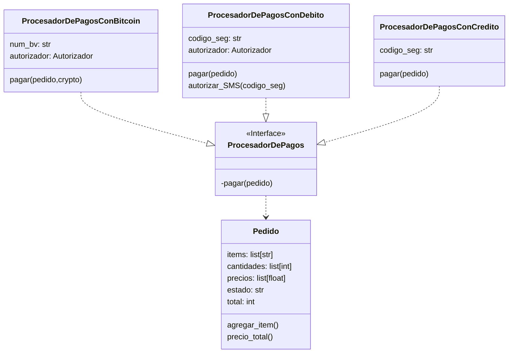

- [Aspectos Generales L3](#aspectos-generales-l3)
  - [Modelos de servicios de red](#modelos-de-servicios-de-red)
    - [CONS: Connection Oriented Network Service | Modelo direccionamiento de Circuito Virtual](#cons-connection-oriented-network-service--modelo-direccionamiento-de-circuito-virtual)
    - [CLNS: ConnectionLess Network Service | Modelo de direccionamiento de datagramas](#clns-connectionless-network-service--modelo-de-direccionamiento-de-datagramas)
  - [Funciones del nivel de Red](#funciones-del-nivel-de-red)
- [Tiempos de servicio](#tiempos-de-servicio)
  - [Propiedades del tiempo de servicio](#propiedades-del-tiempo-de-servicio)
  - [Diseño de capacidad de una red](#diseño-de-capacidad-de-una-red)
- [Protocolo de Internet](#protocolo-de-internet)
  - [Interconexión entre redes](#interconexión-entre-redes)
    - [Necesidad del nivel de red](#necesidad-del-nivel-de-red)

# Aspectos Generales L3

- La capa de red es la capa que se encarga del direccionamiento de los paquetes a través de los diferentes caminos que forman la Internet.
- Su función principal es el direccionamiento.
- Se constituye con enlaces que interconectan dos tipos de nodos:
  - Hosts
  - Routers
- Los routers tienen varias interfaces y los hosts (generalmente) una.
- Cuando se comunican dos hosts en una misma LAN, la capa 3 es casi inexistente.
- De esto se encargan los conmutadores de capa 2, puentes o L2 switches.
- Cuando un hosts quiere comunicarse con otro, en el transcurso del paquete por la red la cabecera de capa 2 cambiará cada vez que llegue a un nodo (exceptuando los conmutadores, que solo revisan la cabecera de capa 2 y en base a esto toman la decisión de reenvío de la trama), ahora, en capa 3, cada que el paquete pase por un Router, el mismo revisará la cabecera de capa 3 y en base a la información contenida en la misma decidirá que hacer con el paquete, si descartarlo o redireccionarlo hacia alguna de sus interfaces basado en la información almacenada en su tabla de enrutamiento. Esto es, la dirección IP origen y destino de un paquete NO cambia en el transcurso del paquete desde su origen hacia su destino.
- ARP es un protocolo de capa 3.
- IP es un protocolo enrutado (routed) de capa 3.
- RIP, EIGRP, IGRP, OSPF, IS-IS, BGP son protocolos (dinámicos) de enrutamiento (routing protocols) de capa 3.
- IP es un protocolo enrutado de capa 3 NO ORIENTADO A CONEXIÓN.
- Los protocolos no orientados a conexión funcionan con datagramas, se toman decisiones de direccionamiento cada vez que un paquete llega a un Router.
- Los protocolos orientados a conexión establecen una conexión cada vez que se va a iniciar una transmisión, toman las decisiones de direccionamiento una sola vez y una vez establecida la conexión no se vuelven a tomar decisiones de direccionamiento, funcionan con PVC’s, o permanente virtual circuits, circuitos virtuales.
- El funcionamiento de los protocolos de capa 3 enrutados orientados a conexión es casi igual que el de los protocolos orientados a conexión de capa 2 como Frame relay o ATM.
- Actualmente se utiliza (casi) siempre protocolos de capa 3 no orientados a conexión, y el predominante es el protocolo de Internet, (IP; Internet Protocol)
- El hecho de que IP sea no orientado a conexión significa que tienen una máxima del mayor esfuerzo, los paqutes pueden llegar desordenados o perderse en el camino y quien se encargará de controlar esto es la capa superior (si es que se utiliza un protocolo de capa 4 orientado a conexión como lo es TCP)
- Los servicios de transmisión son 3:
  - Prioridad; ej.: mensajes de control
  - QoS (Calidad de servicio); umbral de retardo máximo o umbral de requerimiento mínimo
  - Seguridad; restricción de accesos
- El protocolo IP busca no agregar demasiada información redundante a los paquetes, reduce el overhead.

## Modelos de servicios de red

Un modelo de servicio de red define las características del transporte terminal a terminal. Esto es, si la entrega es garantizada o no, si se garantiza el retardo mínimo o no, si los paquetes se entregan en orden, cual es el ancho de banda mínimo garantizado y cuales son los servicios de seguridad que ofrece.

En la realidad, en el Internet se utiliza el protocolo IP que hace uso del servicio del mejor esfuerzo.

### CONS: Connection Oriented Network Service | Modelo direccionamiento de Circuito Virtual

Se establece una conexión antes de iniciar la transmisión. Ej.: modelo de direccionamiento de circuito virtual.

En este modelo cada VC consta de una ruta, números de vc y entradas en las tablas de reenvío de los routers.

En la conexión, la capa de red define la ruta entre el emisor y el receptor, el número de VC para cada ruta del enlace, añade una entrada a la tabla de reenvío de los routers y puede reservar recursos.

Ejemplo:

Cabe destacar que esto no es lo mismo que una red de circuitos, sigue siendo una red conmutada pero con circuitos virtuales, la diferencia con una red conmutada es que no existe reserva de recursos, el circuito es virtual, esto es, en torno a la toma de decisiones de direccionamiento y no de reserva de un canal físico.

### CLNS: ConnectionLess Network Service | Modelo de direccionamiento de datagramas

Este es el modelo utilizado en la realidad, no garantiza la entrega de los paquetes en orden, ni la entrega en sí misma, el mejor esfuerzo hace referencia a que se intenta hacer lo mejor posible por llevar el paquete desde el origen hasta el destino pero no se asegura nada, esta responsabilidad se delega sobre las capas superiores (generalmente la capa de transporte cuando se utiliza el protocolo de capa 4 TCP que es orientado a conexión y es quien se encargará de establecer la conexión lógica en una comunicación entre dos estaciones.

Un servicio CLNS es recomendable cuando la red es poco fiable, por el hecho de que si falla un Router en el camino de un paquete hacia su destino, el mismo podrá tomar otra dirección.

Por el contrario si se utiliza un servicio CONS y falla un Router el paquete no podrá llegar a su destino, por lo que son utilizados cuando la red es muy fiable, como pasa en las redes de telefonía, donde por el contrario, en la capa superior se utiliza un protocolo no orientado a conexión como lo es el UDP.

Algunas de las diferencias de el modelo de direccionamiento de datagramas con respecto al modelo de direccionamiento por circuitos virtuales son las siguientes:

- Cuando una estación quiere enviar un paquete le agrega dirección de origen y destino (dirección IP)
- No se realiza configuración de circuito virtual previa.
- Los routers no mantienen información de estado.
- Cada Router tiene una tabla de reenvío donde asigna direcciones de destino a interfaces de enlace para saber sobre que interfaz debe redireccionar un paquete que se destina a una red determinada.
- Se utiliza un prefijo de red que es la parte de la dirección IP que determina la dirección de red.

## Funciones del nivel de Red

- Elegir la ruta óptima de los paqutes.
  - En CONS solo al momento de establecer el VC.
  - En CLNS cada vez que un paquete llega a un Router.
- Controlar y evitar la congestión. (NC); Criterios de descarte de paquetes.
- Controlar que el usuario no abuse del servicio (QoS)
- Resolver las direcciones del nivel de red con las del nivel de enlace (ARP)

# Tiempos de servicio

Para entender los tiempos de servicio primero hay que entender los tiempos utilizados en la transmisión de datos:

- Tiempo de transmisión (Tt): es el tiempo que tarde un paquete en ser emitido por una interfaz. Se calcula en base al tamaño del paquete (p; en bits) sobre la velocidad de la línea (v;bw – bits/s)
- Tiempo de propagación (t): es el tiempo que tarda un bit en viajar desde la interfaz de origen a la de destino. Depende del medio, esto es, distancia (longitud del cable si es patch cord o fibra óptica) y tipo (cobre, fibra o aire).
- Tiempo de entrega o latencia (Te): es la suma del tiempo de transmisión y el de propagación.
- Tiempo de espera (Tesp): es el tiempo que el paquete espera haciendo cola en la interfaz de entrada del Router hasta que le llega su turno. El tiempo de espera depende del grado de congestión en la interfaz de salida.

Entonces:

- Tiempo de servicio (Ts = Tesp + Tt): es el tiempo que transcurre desde que el paquete llega por la interfaz de entrada (se pone en cola) hasta que se emite por la interfaz de salida. No incluye el tiempo de propagación.
- Por teoría de colas puede demostrarse que:
  - Ts = p/(v-c)
  - P = tamaño del paquete (en bits)
  - Siendo v = velocidad nominal o capacidad de la línea en bits/s.
  - y c = tráfico real de la línea en bits/s.
- Esto es, si un paqute de 500 bytes entra en una línea de 64Kb/s que esta ocupada en un 50%:
  - p = 4000, v = 64000, c = 32000  Ts = 125ms

## Propiedades del tiempo de servicio

Ts = p/(v-c)  Tt = p/v
• Si c = 0, es decir que la línea no tiene tráfico, entonces el tiempo de transmisión es igual al tiempo de servicio.
• Cuando la velocidad de una línea  es elevada podemos llegar a niveles altos de ocupación sin incurrir en tiempos de servicio excesivos.

## Diseño de capacidad de una red

Desde un punto de vista de optimizar recursos lo ideal es que los enlaces tengan un nivel de congestión moderada. Una congestión excesiva provoca la pérdida y reenvío de paquetes, el fallo de protocolos de alto nivel y la frustración de los usuarios.

La ausencia de congestión indica un sobredimensionamiento, lo cual podría significar un derroche de recursos. Hay que tener en cuenta las necesidades y la evolución de tráfico al o largo del día, lo razonable es dimensionar tomando en cuenta las necesidades en horas punta.

# Protocolo de Internet

En el modelo de Internet, el principal protocolo de red es el Protocolo de Internet (IP). La versión actual y dominante es la versión 4 o IPv4, la siguiente generación es IPv6 que no se implementa mucho en la actualidad.

## Interconexión entre redes

Los niveles físico y de enlace de datos de una red funcionan localmente. Estos dos niveles se responsabilizan de la entrega de datos en la red de un nodo al siguiente, como se muestra en la siguiente figura:

Esta interconexión entre redes se hace a partir de cinco redes: cuatro LAN y una WAN. Si el host A necesita enviar un paquete de datos al host D, el paquete necesita ir primero de A a R1 (un conmutador o encaminador), luego de R1 a R3, y finalmente de R3 al host D.

Se dice que el paquete de datos pasa a través de tres enlaces. En cada enlace, se involucran dos niveles físicos y dos niveles de enlace de datos.

Sin embargo, hay un gran problema. Cuando llegan datos a la interfaz f1 de R1, ¿Cómo sabe R1 que la interfaz de salida es f3? No hay nada en el nivel de enlace de datos (o físico) para ayudar a R1 a tomar la decisión adecuada. La trama no transporta ninguna información de encaminamiento. La trama contiene la dirección MAC de A como fuente y la dirección MAC de R1 como destino. Para una LAN o una WAN, la entrega significa transportar la trama a través de un enlace y no más allá.

### Necesidad del nivel de red

Para solucionar el problema de la entrega a través de varios enlaces, se ha diseñado el nivel de red (o el nivel de interconexión entre redes). <mark>**El nivel de red es responsable de la entrega host a host y del encaminamiento de los paquetes a través de los encaminadores o conmutadores.**</mark>

La siguiente figura muestra la misma red anterior pero con un nivel de red añadido:

La siguiente figura muestra la idea general de la funcionalidad del nivel de red en el origen, en el encaminador y en el destino.

El nivel de red en el origen es responsable de crear un paquete a partir de los datos que vienen de otro protocolo (como el protocolo de transporte o un protocolo de encaminamiento). La cabecera del paquete contiene, entre otra información, las direcciones lógicas del origen y del destino. El nivel de red es responsable de comprobar su tabla de encaminamiento para encontrar la información de encaminamiento (tales como la interfaz de salida o la dirección física del siguiente nodo). Si el paquete es demasiado grande se fragmenta.

El nivel de red en el Router es responsable de encaminar el paquete. Cuando llega un paquete, el Router consulta su tabla de enrutamiento y encuentra la interfaz por la que el paquete debe ser enviado. El paquete, después de algunos cambios en la cabecera, se pasa de nuevo al nivel de enlace de datos con la información de encaminamiento. Cabe destacar que estos cambios en la cabecera no implican cambios en los campos de direcciones.

El nivel de red en el destino es responsable de la verificación de la dirección; se asegura que la dirección de destino del paquete es la misma que la dirección de red del host.  Si el paquete es un fragmento, el nivel de red espera hasta que todos los fragmentos han llegado y los reensambla y entrega los paquetes reensamblados al nivel de transporte.

